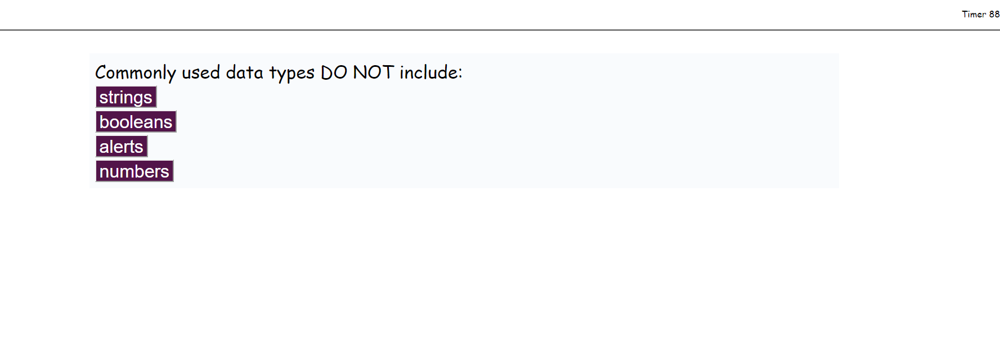

# Code Quiz
https://markspcs.github.io/homeworkWeek4/

## Description

This application launches with a start page.

upon clicking start it will set a timer allowing 15 seconds per question

After the completion of the quiz the application will allow you to save your scores to the local storage of the machine
if you chose to

## Installation

Requires style.css , script.js, questions.js , and index.html to be in the current working directory. 

